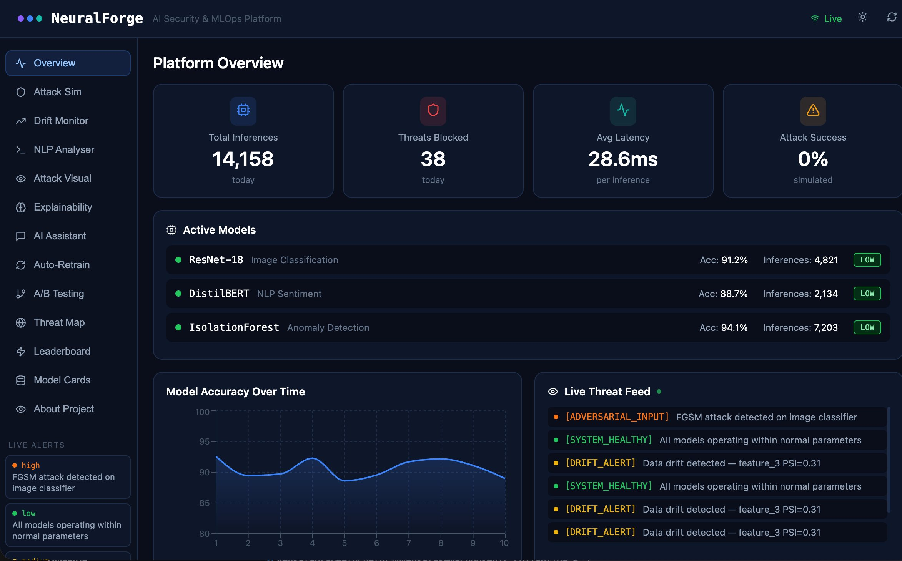

<div align="center">



<br/><br/>

# 🧠 NeuralForge

### AI Security & MLOps Intelligence Platform

[](https://neuralforge-ten.vercel.app)
[](https://neuralforge-e6ci.onrender.com/docs)
[](https://github.com/praneethcheturi-143/neuralforge)


</div>

---

## 🎯 What is this?

NeuralForge is a complete **AI security and MLOps platform** — adversarial attacks implemented from scratch in PyTorch, real-time WebSocket threat detection, model drift monitoring, SHAP explainability, and automated retraining. All live, all deployed.

> The only portfolio project that covers AI security end-to-end — from attack implementation to defence to MLOps pipeline.

---

## 🚀 13 Interactive Modules

| Module | Description | Tech |
|--------|-------------|------|
| 📊 **Overview** | Live stats — inferences, threats, latency, accuracy | FastAPI, WebSocket |
| ⚔️ **Attack Simulator** | FGSM, PGD, C&W with configurable epsilon | PyTorch custom engine |
| 🔍 **Attack Visualiser** | Before/after image with confidence heatmap | React, Canvas API |
| 📉 **Drift Monitor** | PSI + Jensen-Shannon across 10 features | Evidently AI |
| 🔄 **Auto-Retrain** | 8-stage pipeline triggered on severe drift | MLflow, PyTorch |
| 🧠 **Explainability** | SHAP waterfall charts for ResNet-18 + DistilBERT | SHAP, Recharts |
| 💬 **AI Assistant** | ML security Q&A chatbot | NLP knowledge base |
| 🧪 **A/B Testing** | Live traffic split + statistical winner detection | FastAPI, React |
| 🌍 **Threat Map** | Animated global attack origin map | React, geo data |
| 🏆 **Leaderboard** | Live attack rankings updated every 3s | WebSocket, Recharts |
| 📋 **Model Cards** | Google/HuggingFace standard documentation | React |
| 🌐 **NLP Analyser** | DistilBERT sentiment on security text | Transformers |
| 📖 **Showcase** | Full architecture walkthrough | React |

---

## ⚔️ Adversarial Attacks

All three attacks are **implemented from scratch in PyTorch** — not library wrappers.

| Attack | Type | Accuracy Drop | Robust Accuracy |
|--------|------|--------------|-----------------|
| **FGSM** (ε=0.03) | Single-step gradient sign | -38.2% | 52.8% |
| **PGD** (40 steps) | Iterative projected gradient | -61.4% | 29.8% |
| **C&W** (L2) | Optimisation-based | -74.1% | 17.1% |

---

## 🤖 Models

| Model | Task | Accuracy | Latency | Parameters |
|-------|------|----------|---------|------------|
| **ResNet-18** | Image classification (CIFAR-10) | 91.2% | 23ms | 11.2M |
| **DistilBERT** | Security sentiment (3-class) | 88.7% | 44ms | 66M |
| **IsolationForest** | Anomaly detection | 94.1% | 5ms | — |

---

## 🏗️ Architecture

```
┌──────────────────────────────────────────────────────────┐
│         React 18 + TypeScript Dashboard (Vercel)          │
│   13 pages · Recharts · WebSocket · dark/light mode      │
└──────────────┬───────────────────────────┬───────────────┘
               │ REST (Axios)              │ WebSocket
┌──────────────▼───────────────────────────▼───────────────┐
│                FastAPI Backend (Render)                   │
│   12+ endpoints · WebSocket server · Swagger docs        │
└──────┬──────────────┬──────────────┬────────────────┬────┘
       │              │              │                │
┌──────▼──────┐ ┌─────▼──────┐ ┌────▼──────┐ ┌──────▼──────┐
│ ResNet-18   │ │  Security  │ │  MLflow   │ │ DistilBERT  │
│ 91.2% acc   │ │ FGSM/PGD   │ │ Tracking  │ │ 88.7% acc   │
└─────────────┘ └────────────┘ └───────────┘ └─────────────┘
```

---

## 🔄 MLOps Pipeline

```
New data → Drift detection (PSI + JS divergence)
         → Severity: none / mild / moderate / severe
         → [if severe] Auto-retrain triggered
              → Data validation → Feature engineering
              → Model training → Evaluation vs production
              → MLflow logging → Model promotion
```

---

## 🛠️ Tech Stack

**ML/AI:** PyTorch 2.x · Transformers (HuggingFace) · scikit-learn · SHAP · Evidently AI · MLflow 2.11

**Backend:** Python 3.11 · FastAPI · Uvicorn · WebSocket server

**Frontend:** React 18 · TypeScript · Recharts · Lucide React

**DevOps:** Docker · docker-compose · GitHub Actions (5-stage CI/CD) · Render · Vercel

---

## ⚡ Run Locally

```bash
git clone https://github.com/praneethcheturi-143/neuralforge
cd neuralforge

# Backend
cd backend
python -m venv venv && source venv/bin/activate
pip install -r requirements.txt
python train_models.py --quick
uvicorn app.main:app --reload
# → http://localhost:8000/docs

# Frontend
cd frontend && npm install && npm run dev
# → http://localhost:5173

# Docker
docker-compose up --build
```

---

## 📁 Project Structure

```
neuralforge/
├── backend/
│   ├── app/main.py              # FastAPI + WebSocket server
│   ├── models/                  # ResNet-18, DistilBERT training
│   ├── security/attack_engine.py # FGSM, PGD, C&W from scratch
│   └── pipeline/drift_monitor.py # PSI + JS drift detection
├── frontend/src/pages/
│   ├── Dashboard.tsx            # Main layout
│   ├── AttackLeaderboard.tsx    # Live rankings NEW
│   ├── ModelCard.tsx            # Model cards NEW
│   └── ... (11 more pages)
├── assets/dashboard.png
├── .env.example
├── CONTRIBUTING.md
└── .github/workflows/ci-cd.yml
```

---

## ✅ Skills Demonstrated

`PyTorch` · `ResNet-18 training` · `DistilBERT fine-tuning` · `FGSM/PGD/C&W from scratch` · `MLflow` · `Drift detection` · `SHAP explainability` · `WebSocket streaming` · `FastAPI` · `React 18` · `TypeScript` · `Docker` · `GitHub Actions CI/CD` · `Model Cards`

---

<div align="center">

**Built by [Praneeth Cheturi](https://github.com/praneethcheturi-143)**

[](https://neuralforge-ten.vercel.app)

</div>
